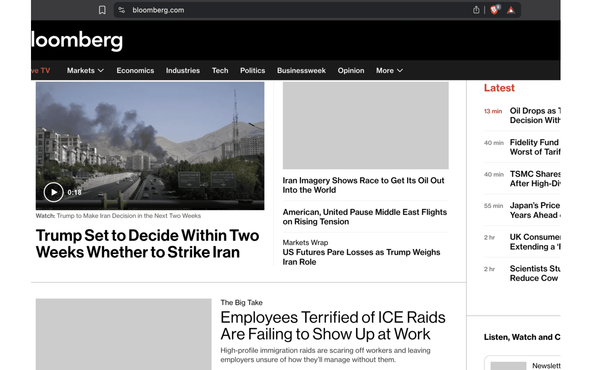

I built this simple chrome extension that blocks from loading most images and videos with the intention of getting less distracted on the internet. 

I used google gemini to generate all of the code. 

This extension might cause you headaches as some websites like Spotify will freak out for a minute or so before rendering properly. 

Some images render regardless (not simple images or media imports)

But I am happy with the experience so i am publishing this 

